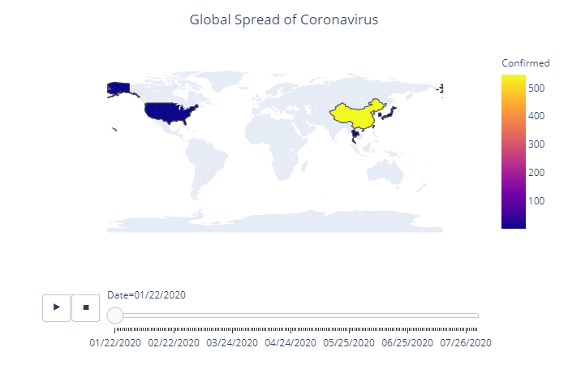
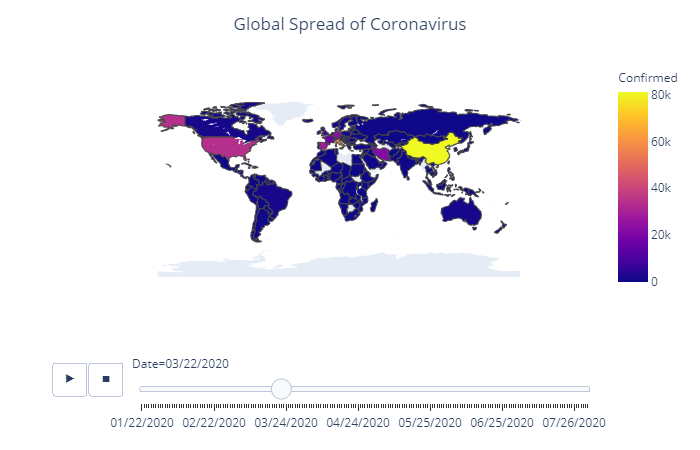
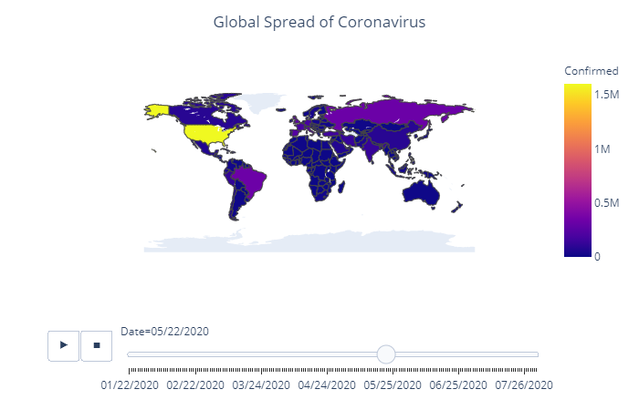
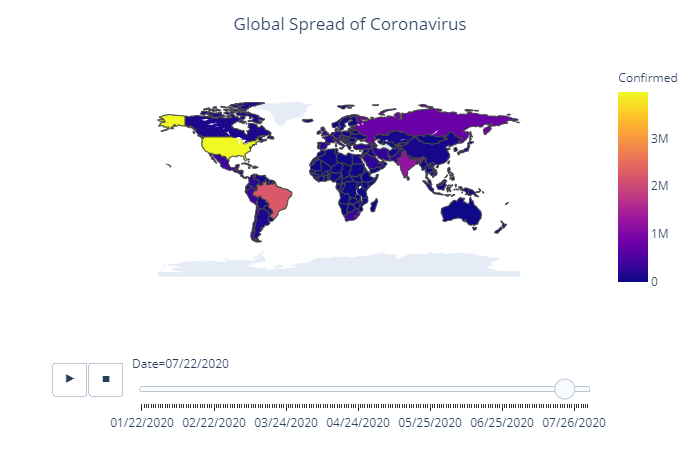

# Covid 19 Analysis in August 2020

### Data Acquisition

This is just an exploratory attempt on a dataset available on Kaggle by sudalairajkumar, it is constantly updated and you can check it out here:

https://www.kaggle.com/sudalairajkumar/novel-corona-virus-2019-dataset

Trying to recreate a project performed by the highly skilled @terenceshin from back in April 2020 which can be found below
https://towardsdatascience.com/visualizing-the-coronavirus-pandemic-with-choropleth-maps-7f30fccaecf5

### Tools

Jupyter Notebook, python, pandas, plotly and its libraries

csv_file = "dataset/covid_19_data.csv"

### Objective

Get a visual analysis of covid 19 using the updated data on a World map.

This is an on going study and analysis of the spread of Covid 19 around the world. Data is contantly being updated which helps fight the spread.

As a student of Data visualization, I wanted to keep up to date with the new findings. 

We will be using the choropleth method for our visualization. This will help us underdanding the spread and pattern of Covid 19 in the world.

Creating a choropleth map is easy with the plotly libraries.

fig = go.Figure(data=go.Choropleth(
    locations = df['Country'],
    locationmode = 'country names',
    z = df['Confirmed'],
    colorscale = 'Reds', #you can choose any colorscheme you prefer
    marker_line_color = 'black',
    marker_line_width = 0.5,
))

I used the following parameters for the map.

fig = px.choropleth(df_countrydate, 
                    #scope = ['usa'], #If you want to only focus on USA map
                    locations="Country", 
                    locationmode = "country names", # use "USA-states" if your data contains states names instead of countries 
                    color="Confirmed", 
                    hover_name="Country", #hovering over a country will display its name and confirmed/death cases

Our next step is to create a timeframe of the spread.

This step required adding an actionpane to the figure and setting Data as a variable. 

animation_frame="Date" was used to show a time lapse on the choropleth map.

Gif could not be inserted to github readme but these are the images from the animated choropleth at work. Images are 2 months apart from another.

## Thank You