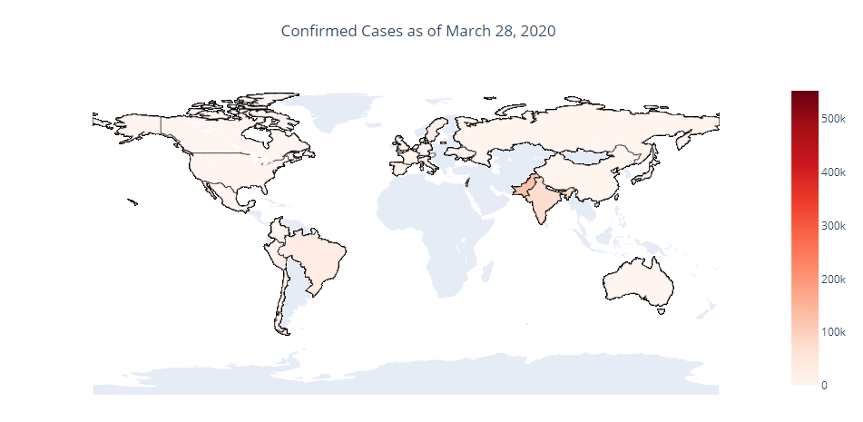

# Covid 19 Analysis in August 2020

### Data Acquisition

This is just an exploratory attempt on a dataset available on Kaggle by sudalairajkumar, it is constantly updated and you can check it out here:

https://www.kaggle.com/sudalairajkumar/novel-corona-virus-2019-dataset

Trying to recreate a project performed by the highly skilled @terenceshin from back in April 2020 which can be found below
https://towardsdatascience.com/visualizing-the-coronavirus-pandemic-with-choropleth-maps-7f30fccaecf5

### Tools

Jupyter Notebook, python, pandas, plotly and its libraries

csv_file = "dataset/covid_19_data.csv"

### Objective

Get a visual analysis of covid 19 using the updated data on a USA map.

We will be using the choropleth method for our visualization.

Our next step is to create a timeframe of the spread.

